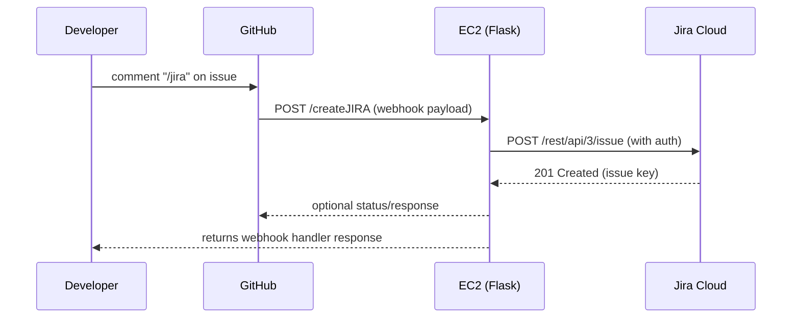

# Jira Ticket Creator (GitHub → Jira)

Lightweight Flask service that listens for GitHub issue comment webhooks and creates a Jira issue when a comment contains the command `/jira`.

## What this project does

- Listens for GitHub webhook events (expects `X-GitHub-Event: issue_comment`).
- When a comment body equals `/jira` (case-insensitive), the service creates an issue in Jira using the Jira REST API.

The main implementation is in `test.py` (function `createJIRA`).

## Files

- `test.py` — main Flask app and webhook handler.

## Prerequisites

- Python 3.8+
- A Jira Cloud account with an API token (or other Jira REST credentials).

## Environment variables

Set these before running the app. Example names used by `test.py`:

- `JIRA_URL` — base URL for your Jira instance (e.g. `https://yourcompany.atlassian.net`).
- `JIRA_API_TOKEN` — API token for the Jira account.
- `JIRA_EMAIL` — email address for the Jira account.

## Installation

Install required Python packages (recommended to use a virtualenv):

```powershell
python -m venv .venv
.\.venv\Scripts\Activate.ps1
pip install --upgrade pip
pip install flask requests
```

You can also create a `requirements.txt` with:

```
flask
requests
```

and install with `pip install -r requirements.txt`.

## Run (development)

In PowerShell, set the environment variables and start the Flask app:

```powershell
#$env:JIRA_URL = "https://yourcompany.atlassian.net"
#$env:JIRA_API_TOKEN = "your_api_token"
#$env:JIRA_EMAIL = "you@example.com"
python test.py
```

The app listens by default on `0.0.0.0:5000` (Flask debug server). For production, run behind a WSGI server (gunicorn/uwsgi) and secure credentials.

## Endpoint

- POST `/createJIRA`
  - Expects a GitHub webhook payload.
  - Requires header `X-GitHub-Event: issue_comment`.
  - Only triggers when the comment body equals `/jira`.

Sample test curl (local):

```powershell
curl -X POST http://localhost:5000/createJIRA `
  -H "Content-Type: application/json" `
  -H "X-GitHub-Event: issue_comment" `
  -d '{"comment": {"body": "/jira", "user": {"login": "octocat"}}, "issue": {"html_url": "https://github.com/org/repo/issues/123"}}'
```

## Implementation notes

- The Jira payload is built in `test.py` and posts to `${JIRA_URL}/rest/api/3/issue`.
- You should update the `project.key` (`"AB"`) and `issuetype.id` values to match your Jira setup.

## Security & production suggestions

- Verify GitHub webhook signatures (HMAC) before trusting payloads.
- Do not run Flask's debug server in production.
- Use environment variable management (secrets manager, .env with proper protections, or CI secrets).

## TODOs

- Validate and verify GitHub webhook signatures.
- Add configurable project key and issue type via env vars or config file.
- Add tests for the webhook handler and Jira request formation.

## Diagrams

Below are two simple Mermaid diagrams illustrating the architecture and the request sequence used by this project. These render on GitHub and many Markdown viewers that support Mermaid. If your viewer doesn't render Mermaid, you can use an online Mermaid live editor (https://mermaid.live) to paste the blocks below and export images.

### Architecture

```mermaid
graph LR
  Dev[Developer / GitHub User] -->|comments on issue| GH[GitHub]
  GH -->|webhook POST /createJIRA| EC2[EC2 Instance (Flask App)]
  EC2 -->|POST /rest/api/3/issue| Jira[Jira Cloud API]
  Jira -->|201 Created| EC2
  EC2 -->|response| GH
```

### Sequence (simplified)



## License

Add an appropriate license file if you intend to open-source this project.
